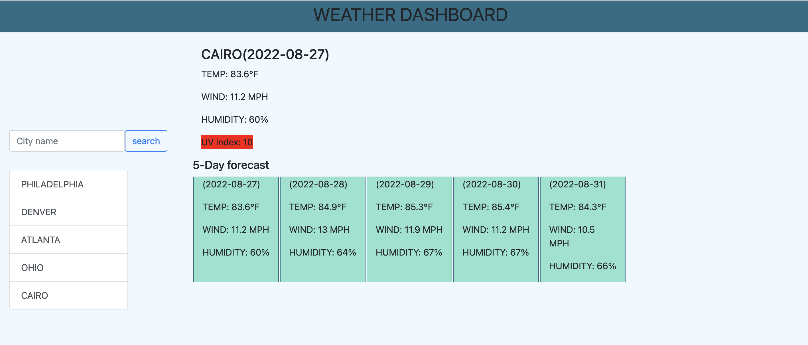
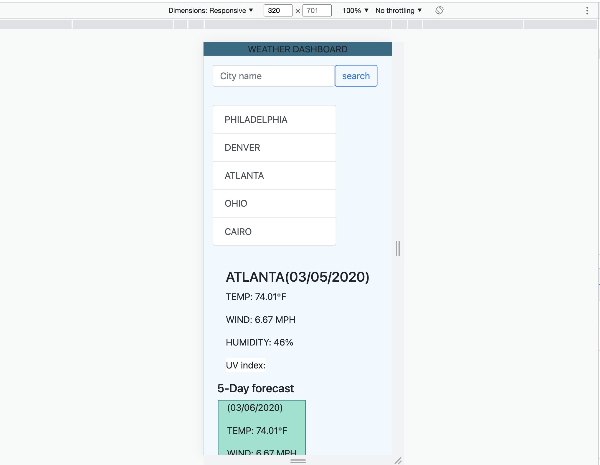

# Weather Dashboard 🌨

## Description

- This application was developed to provide users with instant weather data on any city around the globe.
- It can store the last 5 city searches into local storage and displays them right below the search box.

## User Story

- When I get to the page, then I'll be presented with an input box and a search button.
- When I search for a city I am presented with Temp, Wind, Humidity of each city and its 5 day forecast.
- When I return to the site, I can find my last searched cities saved and I can click on them to re-view data.

## [Site for the live link ](https://miketigray.github.io/weather-dashboard/)

